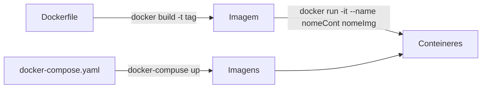

# Docker-compose

```mermaid
graph LR

    Dockerfile --> |docker build -t tag| Imagem --> |docker run -it --name nomeCont nomeImg| Conteineres

    docker-compose.yaml --> |docker-compuse up| Imagens --> Conteineres
```
