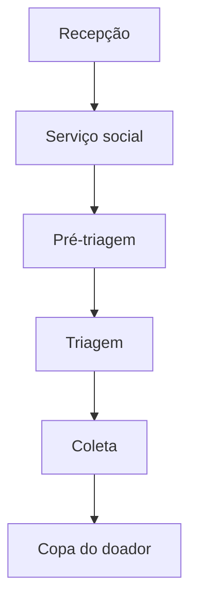

# Etapas da doação de sangue

1. Recepção
2. Serviço social
3. Pré-triagem
4. Triagem
5. Coleta
6. Copa do doador

```mermaid
graph TD

  etapa_1[Recepção]
  etapa_2[Serviço social]
  etapa_3[Pré-triagem]
  etapa_4[Triagem]
  etapa_5[Coleta]
  etapa_6[Copa do doador]

  etapa_1 --> etapa_2 --> etapa_3 --> etapa_4 --> etapa_5 --> etapa_6
```
