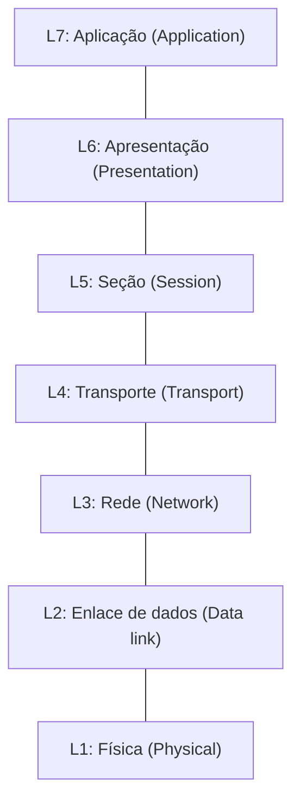

# Modelo ISO/OSI

```mermaid
graph BT

  fis["L1: Física (Physical)"]
  enl["L2: Enlace de dados (Data link)"]
  redes["L3: Rede (Network)"]
  transp["L4: Transporte (Transport)"]
  sec["L5: Seção (Session)"]
  apres["L6: Apresentação (Presentation)"]
  aplic["L7: Aplicação (Application)"]
  
  fis --- enl --- redes --- transp --- sec --- apres --- aplic
```
