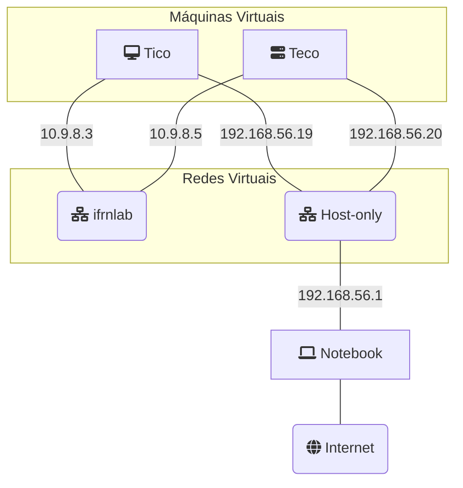

# Tico e Teco

```mermaid
graph TD

    %% Dispositivos
    subgraph Máquinas Virtuais
        tico[fa:fa-desktop Tico]
        teco[fa:fa-server Teco]
    end
    notebook[fa:fa-laptop Notebook]

    %% Redes
    subgraph Redes Virtuais
        ifrnlab(fa:fa-network-wired ifrnlab)
        hostonly("fa:fa-network-wired Host-only")
    end

    internet(fa:fa-globe Internet)
    
    %% Ligações entre redes e dispositivos
    tico --- |10.9.8.3| ifrnlab
    tico --- |192.168.56.19| hostonly
    teco --- |10.9.8.5| ifrnlab
    teco --- |192.168.56.20| hostonly

    hostonly --- |192.168.56.1| notebook --- internet
```
