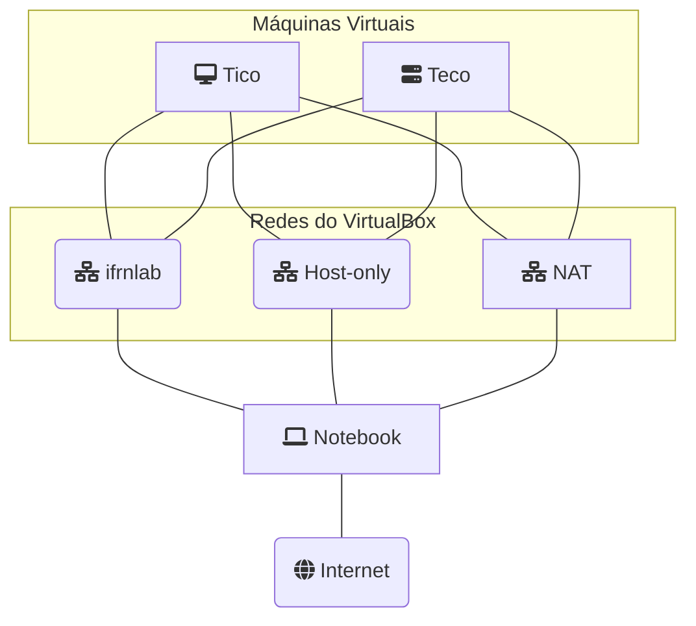

# Tico e Teco

```mermaid
graph TD

    %% Dispositivos
    subgraph Máquinas Virtuais
        tico[fa:fa-desktop Tico]
        teco[fa:fa-server Teco]
    end
    notebook[fa:fa-laptop Notebook]

    %% Redes
    subgraph Redes do VirtualBox
        ifrnlab(fa:fa-network-wired ifrnlab)
        hostonly("fa:fa-network-wired Host-only")
        nat[fa:fa-network-wired NAT]
    end

    internet(fa:fa-globe Internet)
    
    %% Ligações entre redes e dispositivos
    tico & teco --- ifrnlab & hostonly & nat --- notebook --- internet
```
