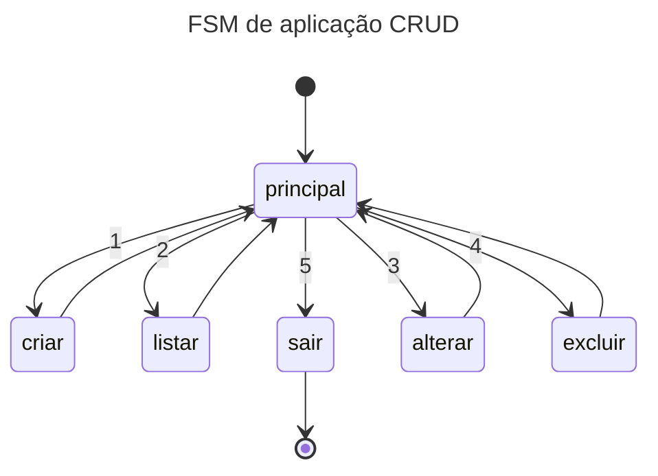

# CRUD

```mermaid
---
title: FSM de aplicação CRUD
---
stateDiagram-v2
  [*] --> principal
  principal --> criar: 1
  criar --> principal
  principal --> listar: 2
  listar --> principal
  principal --> sair: 5
  sair --> [*]
  principal --> alterar: 3
  alterar --> principal
  principal --> excluir: 4
  excluir --> principal

```
