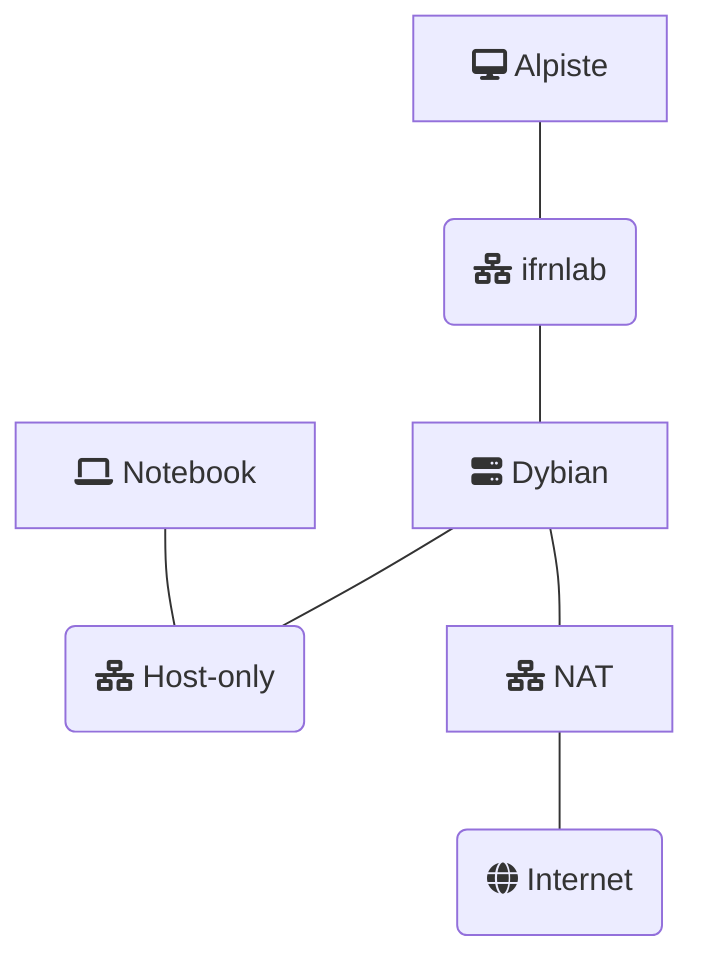

# IFRN Lab

```mermaid
graph TD

  %% Dispositivos
  alpiste[fa:fa-desktop Alpiste]
  dybian[fa:fa-server Dybian]
  notebook[fa:fa-laptop Notebook]

  %% Redes
  ifrnlab(fa:fa-network-wired ifrnlab)
  hostonly("fa:fa-network-wired Host-only")
  internet(fa:fa-globe Internet)
  
  %% Ligações entre redes e dispositivos
  dybian --- hostonly
  notebook --- hostonly
  alpiste --- ifrnlab --- dybian --- NAT[fa:fa-network-wired NAT] --- internet
```
