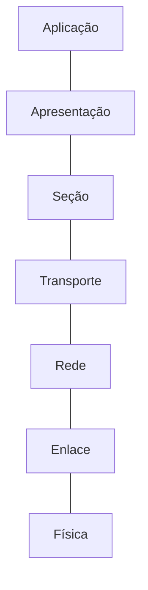

# TCP/IP


```mermaid
graph BT

  fis[Física]
  enl[Enlace]
  redes[Rede]
  transp[Transporte]
  sec[Seção]
  apres[Apresentação]
  aplic[Aplicação]
  
  fis --- enl --- redes --- transp --- sec --- apres --- aplic
```


```
