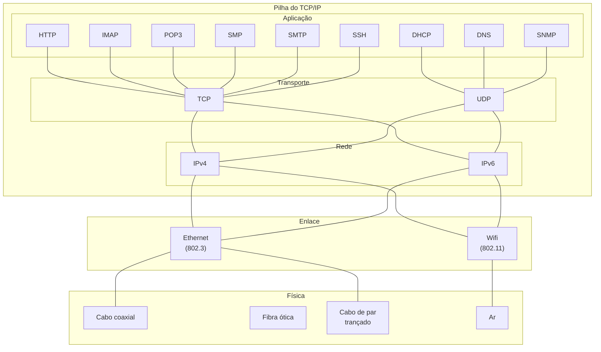

# Protocolos da arquitetura TCP/IP

```mermaid
graph BT

  %% Declaração de um sub-grafo para cada camada
  
  subgraph "Pilha do TCP/IP"
    subgraph Aplicação
      dhcp[DHCP]
      dns[DNS]
      http[HTTP]
      imap[IMAP]
      pop3[POP3]
      smb[SMP]
      smtp[SMTP]
      snmp[SNMP]
      ssh[SSH]
    end

    subgraph Transporte
      tcp[TCP]
      udp[UDP]
    end

    subgraph Rede
      ipv4[IPv4]
      ipv6[IPv6]
    end
  end
  
  subgraph Enlace
    ethernet["Ethernet<br>(802.3)"]
    wifi["Wifi<br>(802.11)"]
  end
  
  subgraph Física
    coaxial[Cabo coaxial]
    fibra[Fibra ótica]
    utp["Cabo de par<br>trançado"]
    ar[Ar]
  end
  
  coaxial & utp --- ethernet
  ar --- wifi
  
  
  ethernet & wifi --- ipv4 & ipv6
  ipv4 & ipv6 --- tcp & udp
  udp --- dhcp & dns & snmp
  tcp --- http & imap & pop3 & smb & smtp & ssh
```
