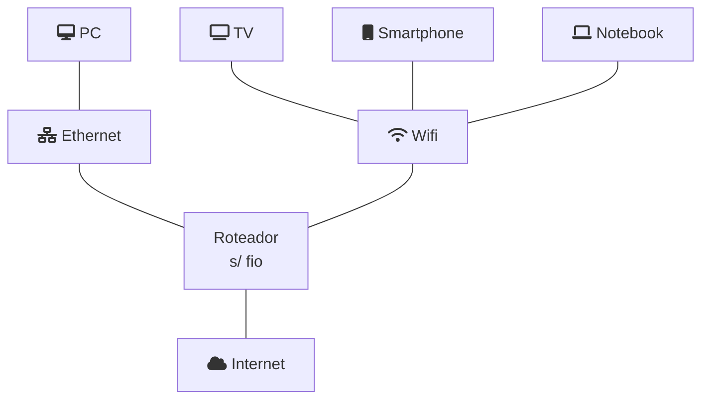

# Rede residencial

```mermaid
graph TD

  %% Dispositivos
  tv[fa:fa-tv TV]
  fone[fa:fa-mobile Smartphone]
  notebook[fa:fa-laptop Notebook]
  pc[fa:fa-desktop PC]
  roteador["Roteador<br>s/ fio"]
  
  %% Redes
  ethernet[fa:fa-network-wired Ethernet]
  wifi[fa:fa-wifi Wifi]
  internet[fa:fa-cloud Internet]
  
  %% Ligações entre redes e dispositivos
  pc --- ethernet
  tv & fone & notebook --- wifi
  ethernet & wifi --- roteador --- internet

```
