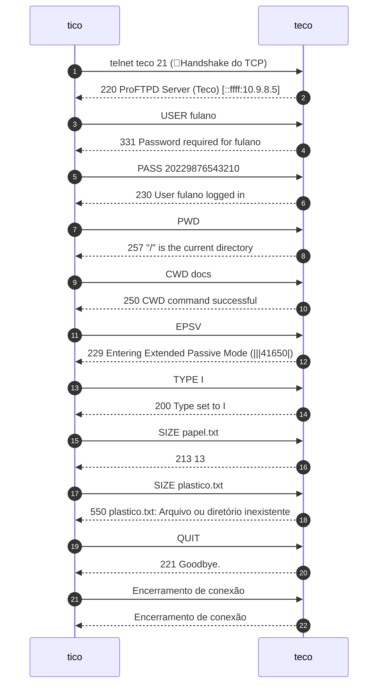

# Sequence diagram for FTP protocol

```mermaid
sequenceDiagram

    autonumber
    tico ->> teco: telnet teco 21 (🤝Handshake do TCP)
    teco -->> tico: 220 ProFTPD Server (Teco) [::ffff:10.9.8.5]
    tico ->> teco: USER fulano
    teco -->> tico: 331 Password required for fulano
    tico ->> teco: PASS 20229876543210
    teco -->> tico: 230 User fulano logged in
    tico ->> teco: PWD
    teco -->> tico: 257 "/" is the current directory
    tico ->> teco: CWD docs
    teco -->> tico: 250 CWD command successful
    tico ->> teco: EPSV
    teco -->> tico: 229 Entering Extended Passive Mode (|||41650|)
    tico ->> teco: TYPE I
    teco -->> tico:  200 Type set to I
    tico ->> teco: SIZE papel.txt
    teco -->> tico: 213 13
    tico ->> teco: SIZE plastico.txt
    teco -->> tico: 550 plastico.txt: Arquivo ou diretório inexistente
    tico ->> teco: QUIT
    teco -->> tico: 221 Goodbye.
    tico ->> teco: Encerramento de conexão
    teco -->> tico: Encerramento de conexão
```