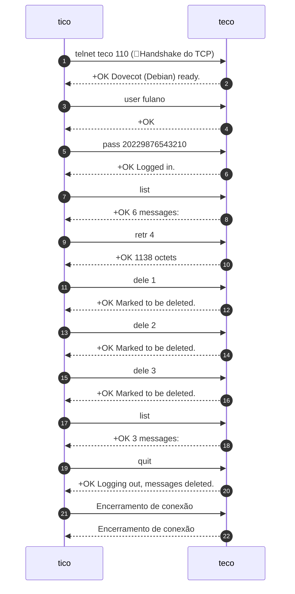

# Sequence diagram for POP3 protocol

```mermaid

sequenceDiagram

    autonumber
    tico ->> teco: telnet teco 110 (🤝Handshake do TCP)
    teco -->> tico: +OK Dovecot (Debian) ready.
    tico ->> teco: user fulano
    teco -->> tico: +OK
    tico ->> teco: pass 20229876543210
    teco -->> tico: +OK Logged in.
    tico ->> teco: list
    teco -->> tico: +OK 6 messages:
    tico ->> teco: retr 4
    teco -->> tico: +OK 1138 octets
    tico ->> teco: dele 1
    teco -->> tico: +OK Marked to be deleted.
    tico ->> teco: dele 2
    teco -->> tico: +OK Marked to be deleted.
    tico ->> teco: dele 3
    teco -->> tico: +OK Marked to be deleted.
    tico ->> teco: list
    teco -->> tico: +OK 3 messages:
    tico ->> teco: quit
    teco -->> tico: +OK Logging out, messages deleted.     
    tico ->> teco: Encerramento de conexão
    teco -->> tico: Encerramento de conexão
```