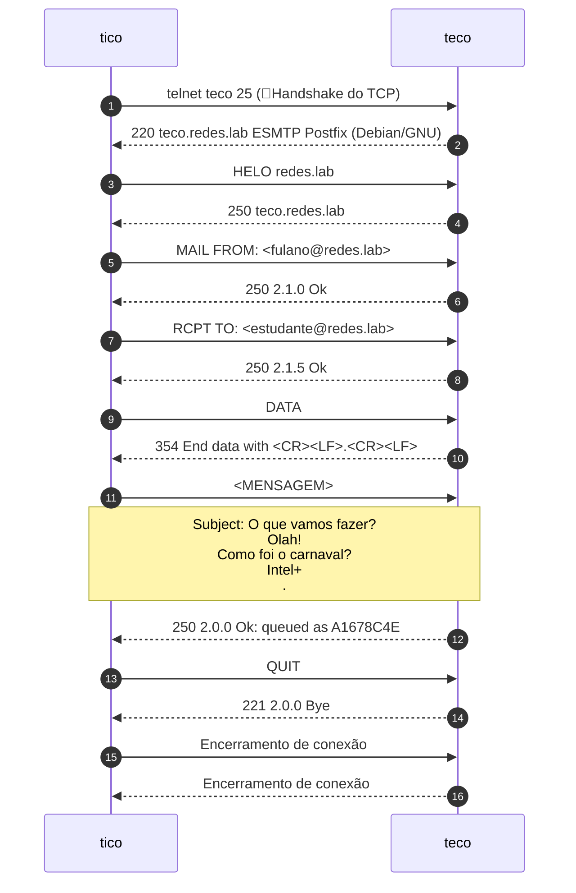

# Sequence diagram for SMTP protocol

```mermaid
sequenceDiagram

    autonumber
    tico ->> teco: telnet teco 25 (🤝Handshake do TCP)
    teco -->> tico: 220 teco.redes.lab ESMTP Postfix (Debian/GNU)
    tico ->> teco: HELO redes.lab
    teco -->> tico: 250 teco.redes.lab
    tico ->> teco: MAIL FROM: <fulano@redes.lab>
    teco -->> tico: 250 2.1.0 Ok
    tico ->> teco: RCPT TO: <estudante@redes.lab>
    teco -->> tico: 250 2.1.5 Ok
    tico ->> teco: DATA
    teco -->> tico: 354 End data with <CR><LF>.<CR><LF>
    tico ->> teco: <MENSAGEM>
    note over tico,teco: Subject: O que vamos fazer?<br>Olah!<br>Como foi o carnaval? <br>Intel+ <br>.
    teco -->> tico: 250 2.0.0 Ok: queued as A1678C4E
    tico ->> teco: QUIT
    teco -->> tico: 221 2.0.0 Bye
    tico ->> teco: Encerramento de conexão
    teco -->> tico: Encerramento de conexão
```    