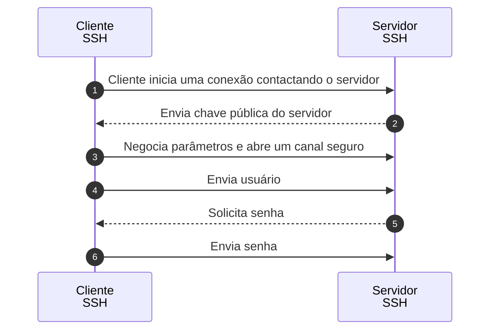

# Diagrama de sequência para SSH

Início de sessão.

```mermaid
sequenceDiagram
    autonumber
    participant cli as Cliente<br>SSH
    participant srv as Servidor<br>SSH

    cli ->> srv: Cliente inicia uma conexão contactando o servidor
    srv -->> cli: Envia chave pública do servidor
    cli ->> srv: Negocia parâmetros e abre um canal seguro
    cli ->> srv: Envia usuário
    srv -->> cli: Solicita senha
    cli ->> srv: Envia senha
```
